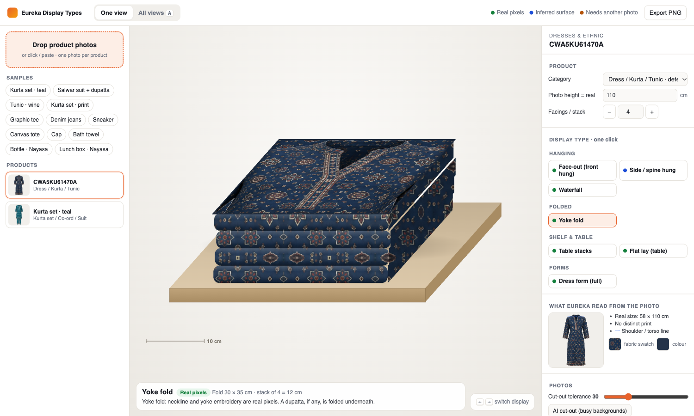
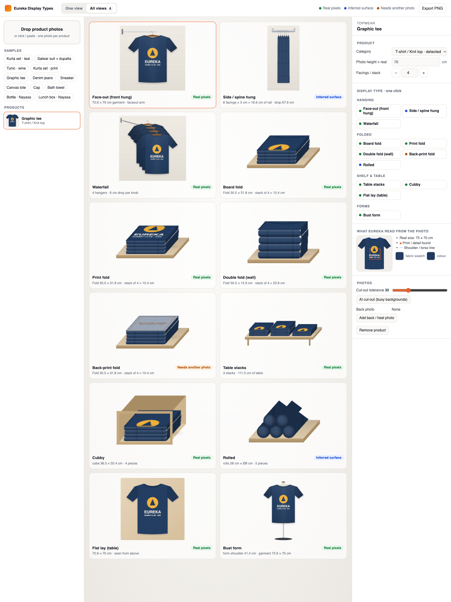
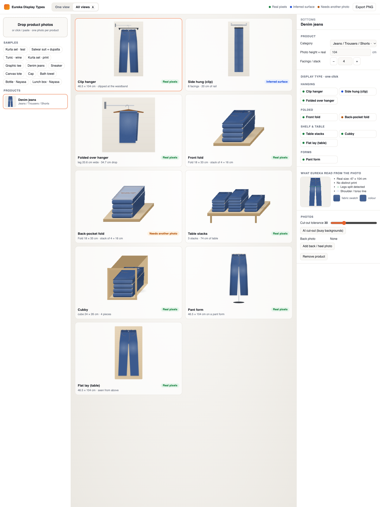

# Eureka Display Types Library

Upload **one ordinary product photo** and see it in every retail display type:
folded, side-hung, face-out, waterfall, stacked, rolled, on a form, on a shelf
or on a peg. Switch between them with one click. It covers apparel, footwear,
bags, accessories, home textiles and hardgoods, and every scene is drawn to true
size in centimetres.

Every view also says **how it was made**. A planogram is an instruction to
stores, so a made-up detail is a compliance bug:

| Badge | Meaning |
|---|---|
| 🟢 **Real pixels** | The visible surface is a crop or warp of the photo itself (fold faces, face-out, flat lay, shelves). |
| 🔵 **Inferred surface** | The photo never saw this surface (spine/side, roll ends, a bag's gusset, the second shoe). It is rebuilt from the product's real fabric swatch and colour. |
| 🟠 **Needs another photo** | The visible surface is what identifies the product but isn't in a front photo (jeans back-pocket fold, back-print fold, heel-out). Add a back photo and it turns green. |



| Tee: all 12 views | Jeans: all 9 views |
|---|---|
|  |  |

## Run it

```bash
npm install
npm run dev        # http://localhost:8766
npm run build      # static site in dist/, deploy anywhere (vercel.json included)
npm run typecheck
```

Drop, click or paste photos into the left panel, or pick a sample. Use
<kbd>←</kbd> <kbd>→</kbd> to step through display types and <kbd>A</kbd> to toggle the
**All views** contact sheet. **Export PNG** saves the current view.

URL parameters: `?s=<sample index>&d=<display id>&view=all&n=<facings/stack>`.

## Display types per vertical (46)

| Vertical | Category | Display types |
|---|---|---|
| Topwear | T-shirt / knit top | face-out, spine, waterfall, board fold, print fold, double (wall) fold, back-print fold, table stacks, cubby, rolled, flat lay, bust form |
| | Shirt | face-out, spine, waterfall, collar fold, double fold, table stacks, cubby, flat lay, bust form |
| | Sweater / hoodie | face-out, spine, waterfall, box fold, table stacks, cubby, flat lay, bust form |
| Dresses & ethnic | Dress / kurta / tunic | face-out, spine, waterfall, yoke fold, table stacks, dress form, flat lay |
| | Kurta set / co-ord / suit | face-out, spine, waterfall, yoke fold, table stacks, dress form, flat lay |
| Bottoms | Jeans / trousers | clip hanger, side-hung clip, folded over hanger, front fold, back-pocket fold, table stacks, cubby, pant form, flat lay |
| Outerwear | Jacket / blazer | face-out, spine, waterfall, bust form, box fold, flat lay |
| Footwear | Side photo | side profile, pair, toe-out ¾, on riser, in box, heel-out |
| Bags | Bag / backpack | front on shelf, on hook, angled ¾, side profile |
| Accessories | Cap | front on shelf, head form, nested stack, on peg |
| | Scarf / stole / dupatta | folded stack, draped on bar, on hanger, flat lay |
| Home textiles | Towel / bed & bath | towel stack, spa rolls, towel bar, cubby |
| Hardgoods | Boxed / packaged | facings on shelf, stacked, peg hook, shelf-ready tray |

Fold sizes follow store standards. Adult tops fold to 12" × 12.5" (30.5 × 31.8 cm),
as in Foot Locker's vendor folding standard. Wall folds are a double fold, at half
the depth and twice the thickness.

## How it works

```
photo ──cutout()──▶ cut-out + mask ──analyse()──▶ landmarks, colour, fabric swatch, print box
                                                     │
              category (auto-detected, overridable) ─┤
                                                     ▼
                        DISPLAYS[id].build(product) ─▶ Scene { w, h cm, prov, note, dims, paint() }
                                                     ▼
                                   stage / contact sheet / PNG export (true scale, 10 cm bar)
```

| File | Role |
|---|---|
| `src/image.ts` | Background removal for catalogue shots: the backdrop colour is estimated from the border, everything connected to the border is flood-filled out, large enclosed backdrop holes (bag handles) are removed, and the edge is feathered. `analyse()` finds the shoulder line, torso, leg split, hang point, dominant colour, a representative fabric swatch and the densest print/embroidery window. |
| `src/draw.ts` | Primitives in cm: a mesh warp (photo → any quad), seamless fabric patterns at true scale, drape and cylinder shading, and fixtures (rails, hangers, clip hangers, shelves, tables, arms, peg hooks, dress/head forms, risers, boxes). |
| `src/displays.ts` | 13 categories, 46 display scenes. Each scene reports its provenance and a one-line explanation. Folds crop the photo at the standard fold size and lay it over the fabric swatch so tucked edges read as fabric. |
| `src/samples.ts` | Samples: real Eureka/Nayasa catalogue photos plus procedurally drawn studio shots (tee, jeans, sneaker, tote, cap, towel). These go through the same pipeline as uploads. |
| `src/app.ts` | UI: upload, product list, one-click display buttons, all-views grid, back photo, cut-out tolerance, optional AI cut-out, PNG export. |

**AI cut-out** (optional) loads `@imgly/background-removal` from a CDN on first
use, for photos on busy backgrounds. Everything else runs locally in the browser.

## Where this goes next

This is the **geometric (v2)** tier from the Eureka asset-pipeline plan. In
the main app, these scenes become `ProductAssetVariant`s per SKU. The next tiers
plug into the same `Scene` contract:

- **Generative refine (v3):** send the photo and this render to an image-edit model
  as a structure guide, for photoreal hero views and the 🟠 cases. Results are
  flagged for VM approval.
- **3D for rigid goods:** single image → mesh (TRELLIS 2 / Hunyuan3D / Tripo) for
  true ¾ views of shoes, bags and caps.
- **Try-on** for mannequin and bust views.
